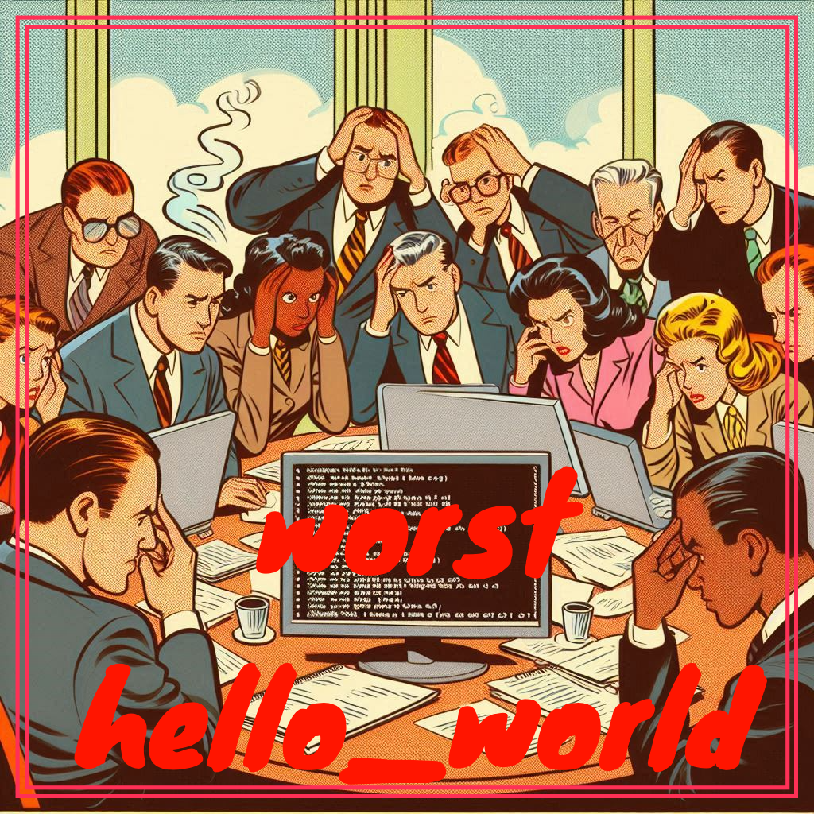

  

## 🚀 SYNOPSIS

This repository is a playful twist on the classic "Hello, World!" program, designed to give beginner candidates a fun yet frustrating challenge.

Created during the piscine at 42, this project aims to break the ice, spark creativity, and encourage problem-solving in an unconventional way.

As experienced programmers, we know how nerve-wracking the first steps in coding can be, especially in C.

To help relax the tension and make the learning process more enjoyable, we developed with [@DyDaDo13](https://github.com/DyDaDo13) this quirky challenge.

It's not just about writing "Hello, World!" – it's about writing it in the worst way possible. Think convoluted logic, unnecessary complexity, and a touch of madness.

## 🛠️ PROGRAM SPECIFICITIES AND CONSIDERATIONS

Each sub-directory contains a very unique way of solving this challenge.

> [!IMPORTANT]
> Each username has been anonymized, feel free to claim your code by adding your 42 username to your project with a pull request.

> [!WARNING]
> Each code submitted during this contest was for fun only. The code on this repo are not mine, so feel free to use them and modify them as you wish.

